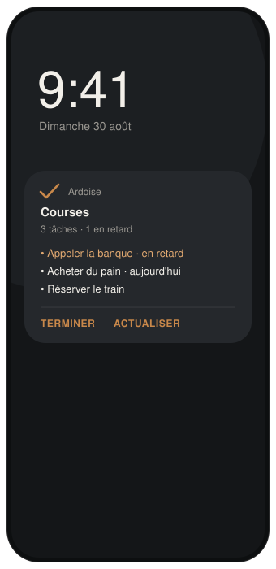
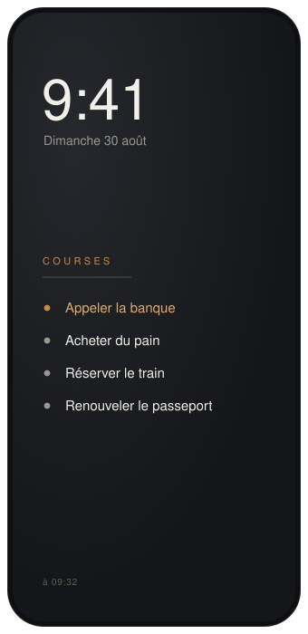

<p align="center">
  
</p>

<p align="center">
  
  
  
  
  
</p>

---

## Le problème

Aucune application n'affiche une liste **Google Tasks** en permanence sur
l'écran de verrouillage Android.

Les widgets d'écran de verrouillage de Google sont bridés en taille, en
fréquence de rafraîchissement et en placement. Les applications de notes
persistantes n'ont pas de synchronisation — vous recopiez à la main. Les
applications de tâches qui ont, elles, une notification permanente ne se
synchronisent pas avec Google Tasks.

## L'intuition

Sur Android, la surface réellement « toujours visible » de l'écran de
verrouillage **n'est pas le widget**. C'est la notification, et
accessoirement le fond d'écran.

Une notification `ongoing` en `BigTextStyle` affiche six à huit lignes, accepte
des boutons d'action, échappe au throttling des widgets et survit au
redémarrage. Le fond d'écran de verrouillage, lui, est un `Bitmap` que
l'application peut redessiner à volonté — contrôle typographique total.

Ardoise exploite ces deux surfaces à partir d'une source unique.

<table>
  <tr>
    <td width="50%" align="center"></td>
    <td width="50%" align="center"></td>
  </tr>
  <tr>
    <td align="center"><b>Notification permanente</b><br><sub>Cochez une tâche sans déverrouiller.</sub></td>
    <td align="center"><b>Fond d'écran de verrouillage</b><br><sub>Rendu maison, sous l'horloge système.</sub></td>
  </tr>
</table>

## Ce que fait Ardoise

- Affiche la liste Google Tasks de votre choix, en continu, sur l'écran de
  verrouillage.
- Marque les tâches en retard, en ocre.
- Permet de cocher la première tâche **depuis l'écran verrouillé**, sans
  déverrouiller le téléphone.
- Continue de fonctionner hors ligne et après un redémarrage, à partir d'un
  cache local.
- Ne stocke **aucun jeton d'accès** et ne contient **aucun secret client**.
  Rien ne quitte votre téléphone, sauf les appels à l'API Google.

## Ce qu'Ardoise ne fait pas

Créer ou modifier des tâches, gérer les sous-tâches, les notes ou plusieurs
comptes. L'application Google Tasks fait déjà tout cela très bien. Ardoise est
une surface d'affichage, pas un gestionnaire de tâches.

## Architecture

```
  UI (Compose)          HomeScreen, LockPreview, HomeViewModel
        |
  Domain                TaskRepository, RenderSnapshot, SnapshotMapper
        |
  Data                  TasksApi (REST), AuthProvider, SettingsStore, SnapshotStore
```

Les deux moteurs de rendu consomment le même `RenderSnapshot` et ne connaissent
ni le réseau, ni l'authentification, ni le stockage.

| Choix | Pourquoi |
|---|---|
| Client REST maison | `google-api-services-tasks` est lourd et pénible sur Android. Trois appels suffisent. |
| Google Identity Services | Renvoie un jeton frais à chaque appel : rien à stocker, rien à rafraîchir, pas de serveur. |
| `WorkManager` en polling | L'API Google Tasks n'offre ni webhook ni push. Le polling n'est pas un raccourci, c'est la seule option. |
| Snapshot JSON, pas de base | Une cinquantaine de lignes de texte, toujours lues d'un bloc. Room serait de l'ingénierie excessive. |

## Installation

Ardoise n'est pas sur le Play Store : le scope `tasks` est un scope sensible,
dont la publication imposerait une vérification OAuth complète. Pour un usage
personnel, on reste en mode « test » et on s'auto-autorise — aucune friction.

**1. Créez un identifiant OAuth**

Sur [Google Cloud Console](https://console.cloud.google.com/) :

1. Créez un projet, puis activez l'**API Google Tasks**.
2. Écran de consentement OAuth : type **Externe**, statut **Test**, et
   ajoutez votre adresse Google dans *Utilisateurs de test*.
3. Ajoutez le scope `https://www.googleapis.com/auth/tasks`.
4. Créez un **ID client OAuth** de type **Android** :
   - nom du package : `fr.ardoise.tasks`
   - empreinte SHA-1 : celle de votre clé de signature

```bash
# empreinte SHA-1 de la clé de debug
keytool -list -v -keystore ~/.android/debug.keystore \
        -alias androiddebugkey -storepass android -keypass android
```

Aucun fichier n'est à ajouter au dépôt : l'identifiant Android est associé au
couple package + SHA-1 côté Google, pas embarqué dans l'application.

**2. Compilez et installez**

```bash
git clone <ce-dépôt> && cd ardoise
echo "sdk.dir=$ANDROID_HOME" > local.properties
./gradlew :app:installDebug
```

**3. Réglez Android**

Ouvrez Ardoise, connectez votre compte, choisissez une liste. Puis, dans les
réglages système :

> **Paramètres → Notifications → Notifications sur l'écran de verrouillage →
> Afficher tout le contenu**

Sans cela, Android masque le texte de la notification sur l'écran verrouillé.

## Développement

```bash
./gradlew :app:testDebugUnitTest   # 30 tests unitaires
./gradlew :app:assembleDebug       # APK de debug
```

Les tests couvrent le calcul des retards, le mapping de l'API, la rédaction de
la notification, le client REST (via `MockWebServer`) et le rendu du fond
d'écran (via Robolectric en mode graphique natif). Le chemin
d'authentification et l'écriture effective du fond d'écran se vérifient sur un
appareil réel : ils dépendent des services Google Play et du système.

## Limites assumées

1. **Jusqu'à 30 minutes de latence** entre une modification faite ailleurs et
   son affichage. Inhérent au polling ; réglable sur 15 minutes.
2. **`FLAG_LOCK` n'est pas honoré par tous les constructeurs.** L'échec est
   détecté à l'exécution et la surface se désactive proprement.
3. **Le fond d'écran de verrouillage est remplacé** quand la surface est
   activée. Elle est désactivée par défaut, précisément pour cette raison.

## Nom

Une ardoise, c'est une surface sombre où l'on écrit en clair, qu'on essuie et
qu'on réécrit. C'est la description exacte d'un écran de verrouillage. La
charte graphique en découle : charbon `#1C1E21`, craie `#F2EFE9`, ocre
`#C9884A` pour ce qui a dépassé sa date.

## Licence

MIT — voir [LICENSE](LICENSE).
