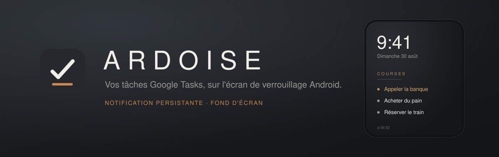
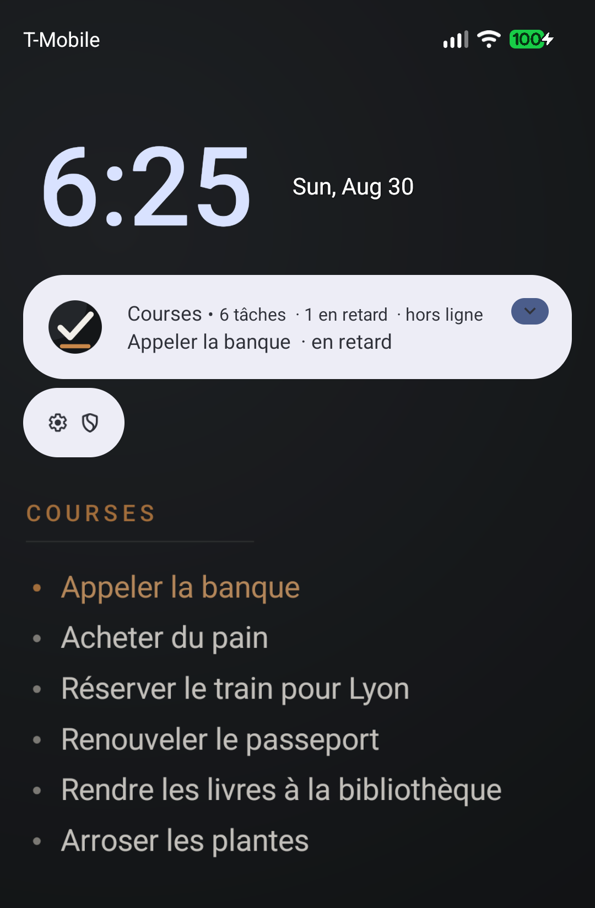
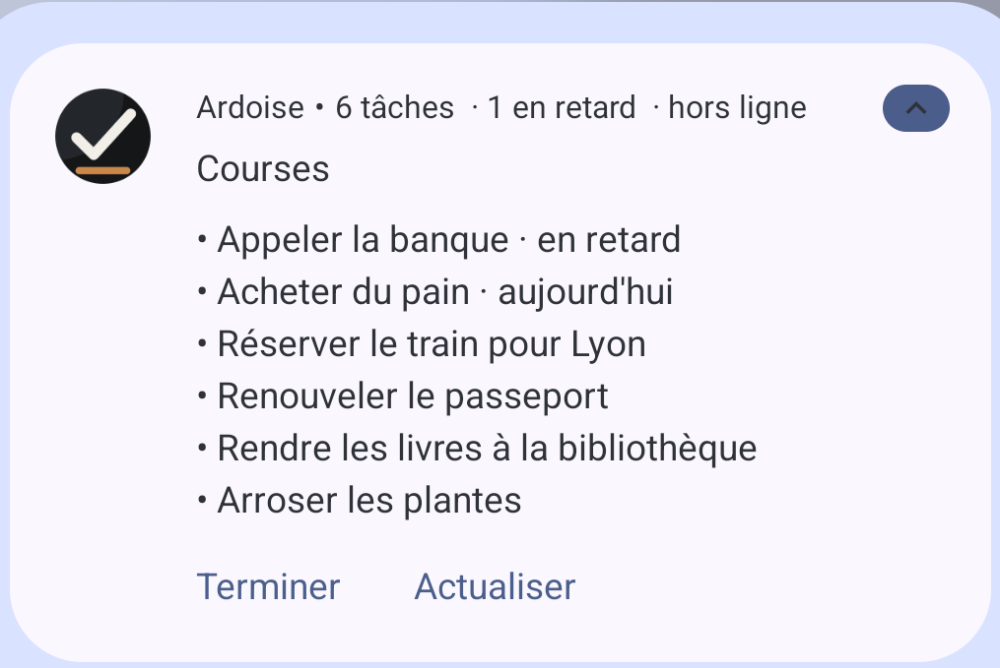
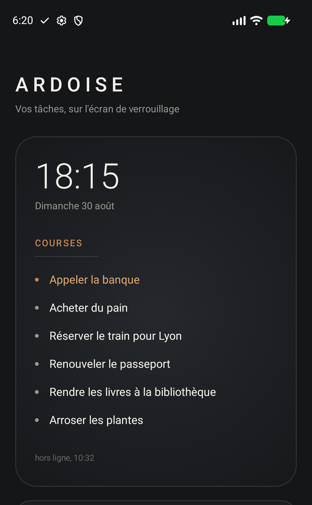

<p align="center">
  
</p>

<p align="center">
  
  
  
  
  
  
</p>

---

## The problem

No app keeps a **Google Tasks** list permanently on the Android lock screen.

Google's lock screen widgets are capped in size, refresh rate and placement.
Sticky-note apps have no sync — you retype everything by hand. The task apps
that *do* have a permanent notification don't sync with Google Tasks.

## The idea

On Android, the surface that is genuinely always visible on the lock screen
**is not the widget**. It is the notification, and secondarily the wallpaper.

An `ongoing` notification in `BigTextStyle` shows six to eight lines, takes
action buttons, escapes widget throttling and survives a reboot. The lock
screen wallpaper is a `Bitmap` the app may redraw at will — full typographic
control.

Ardoise drives both surfaces from one source.

<table>
  <tr>
    <td width="42%" align="center"></td>
    <td width="58%" valign="middle">
      
      <br><br>
      <sub>Left: both surfaces at once on the lock screen — the notification on
      top, the rendered wallpaper beneath it. Right: the notification expanded —
      six lines, overdue items flagged, and both actions reachable without
      unlocking.</sub>
    </td>
  </tr>
</table>

<sub>Real screenshots, Pixel 9a on Android 17 (API 37), shown in French.</sub>

## What Ardoise does

- Keeps the Google Tasks list of your choice on the lock screen, continuously.
- Marks overdue tasks in ochre.
- Lets you tick the first task off **from the locked screen**, without
  unlocking the phone.
- Keeps working offline and after a reboot, from a local cache.
- Stores **no access token** and contains **no client secret**. The only
  network destination is Google's own API, and the cached list is excluded from
  cloud backup and device transfer, so task titles stay on the device.
- Speaks **English and French**, following the system language. English is the
  default locale, and therefore the fallback for every other language.

## What Ardoise does not do

Create or edit tasks, handle subtasks, notes, or multiple accounts. The Google
Tasks app already does all of that well. Ardoise is a display surface, not a
task manager.

---

# Setting it up

**This is the part that takes the time.** Read it once through before starting.

## Why there is any setup at all

Google will not issue a token for the Tasks API unless an OAuth client exists,
in some Google Cloud project, for the exact **package name + signing
certificate** of the app making the request. That binding is per-build, so no
distributed copy of Ardoise can carry a working client for you. You register
your own, once.

There is no way around it, and not for lack of trying. Both of Google's
authentication paths enforce it — verified on a real device with a real
account:

| Path | Result |
|---|---|
| `AuthorizationClient` (Google Identity Services) | `ApiException 8` — `UNREGISTERED_ON_API_CONSOLE` |
| `GoogleAuthUtil.getToken` (account manager, predates GIS) | `GoogleAuthException: UnregisteredOnApiConsole` |

The older path historically needed no client ID at all. That is no longer
true. A complete fallback was written, driven through the account picker on a
Pixel 9a, and then deleted.

## 1. Build and install

```bash
git clone https://github.com/myqzurdux3/ardoise && cd ardoise
# ANDROID_HOME must point at your SDK; Android Studio writes this file for you
# if you open the project instead.
echo "sdk.dir=${ANDROID_HOME:?set ANDROID_HOME to your Android SDK path}" > local.properties
./gradlew :app:installDebug
```

## 2. Get your two values

Open Ardoise. It will tell you it is not registered and show a **Setup
required** card carrying both values, each with a copy button. They are read
from the running build, so they are always right for the copy you installed.

You can also read the fingerprint yourself:

```bash
keytool -list -v -keystore ~/.android/debug.keystore \
        -alias androiddebugkey -storepass android -keypass android | grep SHA1
```

The package name is `fr.ardoise.tasks` unless you changed `applicationId`.

## 3. Register the client in Google Cloud Console

Create a project at [console.cloud.google.com](https://console.cloud.google.com/),
then, replacing `YOUR_PROJECT` in each link with its id:

**a. Enable the Tasks API**

`https://console.cloud.google.com/apis/library/tasks.googleapis.com?project=YOUR_PROJECT`

Press **Enable**.

**b. Configure the consent screen**

`https://console.cloud.google.com/auth/branding?project=YOUR_PROJECT`

Fill in an app name and your own email as the support contact. Audience type
**External**.

**c. Add yourself as a test user — do not skip this**

`https://console.cloud.google.com/auth/audience?project=YOUR_PROJECT`

Under **Test users**, add the Google account whose tasks you want to see. In
testing mode Google refuses every account that is not on that list, with:

> This app is being tested and can only be accessed by developer-approved
> testers.

There is no "developer" role to add yourself to; the list is called *Test
users* and that is the one that matters. The support email higher up the page
grants nothing.

**d. Create the client**

`https://console.cloud.google.com/auth/clients/create?project=YOUR_PROJECT`

Application type **Android**. Then:

| Field | Value |
|---|---|
| Package name | `fr.ardoise.tasks` |
| SHA-1 certificate fingerprint | the fingerprint from step 2 |

> **How to know you picked the right type.** An Android client offers **no
> JSON download**, because it has no secret — it is bound to the package and
> fingerprint instead. If the console offers you a `client_secret_*.json`, you
> created a Web or Desktop client and it will never work here. A downloaded
> file whose root key is `"installed"` is a Desktop client; `"web"` is a Web
> client. Neither is what you want.

Nothing from the console goes into this repository. Do not commit any
`client_secret_*.json` or API key; both are gitignored for that reason.
Ardoise needs **no API key** — the OAuth token alone authorises the calls.

## 4. Allow the notification on the lock screen

Changes take a few minutes to propagate. Then open Ardoise, press **Connect
Google Tasks**, pick your account, and choose a list.

Finally, in system settings:

> **Settings → Notifications → Notifications on lock screen → Show all content**

Without it, Android hides the notification text on the locked screen.

## Troubleshooting

| What you see | Cause | Fix |
|---|---|---|
| Setup required card; log shows `UNREGISTERED_ON_API_CONSOLE` | No **Android** client for this package + SHA-1 | Step 3d. Check the type is Android, and that the fingerprint is SHA-1 (40 hex characters), not SHA-256 (64) |
| "This app is being tested and can only be accessed by developer-approved testers" | Your account is not a test user | Step 3c |
| Account picker appears, then the app reports a refusal you never made | Google rejects *after* account selection, so the refusal looks like yours | Read the real cause under the `ArdoiseAuth` log tag: `adb logcat -s ArdoiseAuth` |
| Connected, but the list is empty | A list is selected but genuinely has no open tasks, or none is selected yet | Pick a list in the app |
| Sign-in works for a week, then stops | Testing-mode grants expire after 7 days | Reconnect, or publish the app (below) |

**Publishing to avoid the weekly reconnection.** On the *Audience* page, press
**Publish app**. Because `tasks` is a sensitive scope, an unverified published
app shows a "Google hasn't verified this app" interstitial that you pass via
*Advanced*. No verification review is required while you are the only user.

---

## Architecture

```
  ui       HomeScreen, LockPreview, HomeViewModel, MainActivity
  domain   TaskRepository, RenderSnapshot, SnapshotMapper
  data     TasksApi (REST), SettingsStore, SnapshotStore
  auth     AuthProvider, SigningIdentity
  render   SurfaceRenderer, NotificationRenderer, WallpaperRenderer,
           WallpaperCanvas, NotificationText, SyncStamp, Wording
  work     SyncWorker, DayRolloverWorker, SyncScheduler,
           TaskActionReceiver, BootReceiver
```

`render` is where the app earns its keep: both surfaces are drawn there, from
one `RenderSnapshot`. Neither renderer knows the network or authentication;
`WallpaperRenderer` keeps a single storage key, to avoid repainting a bitmap
that has not changed. See [docs/design-notes.md](docs/design-notes.md) for the
layering and the reasoning behind it.

| Choice | Why |
|---|---|
| Hand-rolled REST client | `google-api-services-tasks` is heavy and awkward on Android. Three calls are enough. |
| Google Identity Services | Returns a fresh token on every call: nothing to store, nothing to refresh, no server. |
| `WorkManager` polling | The Google Tasks API offers neither webhooks nor push. Polling is not a shortcut, it is the only option. |
| A JSON snapshot, not a database | Fifty lines of text, always read as a whole. Room would be over-engineering. |

## Two traps only a device reveals

The unit tests passed and the lock screen proved the code wrong. Both fixes
below came from running it, not from review.

**1. `IMPORTANCE_LOW` destroys the feature.**
It is the obvious choice for a permanent, silent notification. But Android
files `LOW` under "silent" notifications and **collapses them to a bare icon**
on the lock screen — not one line of text survives. The right combination is
`IMPORTANCE_DEFAULT` with the sound muted at channel level: still no sound, no
vibration, no heads-up banner, but the notification stays expandable and ranked.

**2. The wallpaper is requested far wider than the screen.**
The system here asks for a 4848 × 2424 canvas for a 1080 × 2424 screen — twice
the longest side, so the home screen can parallax and so the image survives
rotation. A screen-sized bitmap gets scaled to fill it and the composition
breaks. Passing a `visibleCropHint` covering the whole bitmap pins it to the
screen.

## The app

<p align="center">
  
</p>

One screen. It shows a live preview of what the lock screen will look like —
the only honest way to tune a surface you cannot see while configuring it.

## Development

```bash
./gradlew :app:testDebugUnitTest   # 58 unit tests
./gradlew :app:assembleDebug       # debug APK
```

The tests cover overdue calculation, API mapping and title sanitising,
notification wording and counts, the REST client and its status handling (via
`MockWebServer`), the sync stamp, the midnight delay across time zones and a
daylight-saving night, the signing fingerprint format, and wallpaper rendering
(via Robolectric in native graphics mode).

The rest was verified on device: both surfaces on a real lock screen, the
notification expanded with its actions, the permission warning clearing on
resume, the switch to "offline" when a sync fails, and — on a physical Pixel 9a
with a real Google account — the full authentication path through to reading
live tasks.

## Permissions

Four, and each is load-bearing:

| Permission | Why |
|---|---|
| `INTERNET` | Calling the Google Tasks API. |
| `POST_NOTIFICATIONS` | The primary surface is a notification. |
| `SET_WALLPAPER` | Only when the wallpaper surface is switched on. |
| `RECEIVE_BOOT_COMPLETED` | Restoring both surfaces after a reboot. |

Nothing is exported that another app can drive: the action receiver is
`exported="false"` and reachable only through Ardoise's own immutable
`PendingIntent`s.

## Known limits

1. **15 to 60 minutes of latency** between a change made elsewhere and its
   appearance, 30 by default. Inherent to polling — the API offers no push.
   Day rollover is separate: a worker repaints at local midnight from cache, so
   "today" and "overdue" stay right even with no network.
2. **`FLAG_LOCK` is not honoured by every manufacturer.** The failure is
   detected at runtime and the surface disables itself cleanly.
3. **The lock screen wallpaper is replaced** when that surface is enabled. It
   is off by default for exactly that reason.

## The name

*Ardoise* is French for slate: a dark surface written on in light strokes,
wiped and rewritten. That is the exact description of a lock screen. The
palette follows — charcoal `#1C1E21`, chalk `#F2EFE9`, ochre `#C9884A` for
whatever has slipped past its date.

## Licence

MIT — see [LICENSE](LICENSE).
